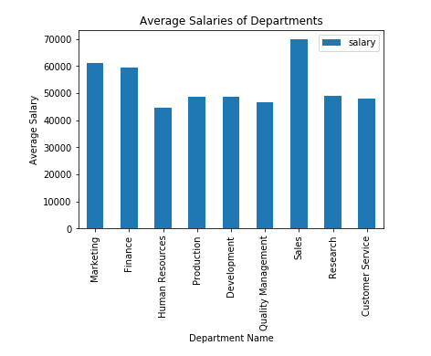

# sql-challenge
For this project I utilized Data Modeling, Data Engineering, and Data Analysis in order to research past employee data for a company. I designed tables to hold data in CSVs, imported the CSVs into a SQL database, and answered questions about the data.

#### Data Modeling

Inspected the CSVs and sketched out an ERD of the tables.

#### Data Engineering

* Use the information you have to create a table schema for each of the six CSV files.

* Imported each CSV file into the corresponding SQL table.

#### Data Analysis

Once you have a complete database, do the following:

1. Listed the following details of each employee: employee number, last name, first name, gender, and salary.

2. Listed employees who were hired in 1986.

3. Listed the manager of each department with the following information: department number, department name, the manager's employee number, last name, first name, and start and end employment dates.

4. Listed the department of each employee with the following information: employee number, last name, first name, and department name.

5. Listed all employees whose first name is "Sasha" and last names begin with "B."

6. Listed all employees in the Sales department, including their employee number, last name, first name, and department name.

7. Listed all employees in the Sales and Development departments, including their employee number, last name, first name, and department name.

8. In descending order, listed the frequency count of employee last names, i.e., how many employees share each last name.

9. Imported the SQL database into Pandas.

10. Created a histogram to visualize the most common salary ranges for employees.

11. Created a bar chart of average salary by title.

